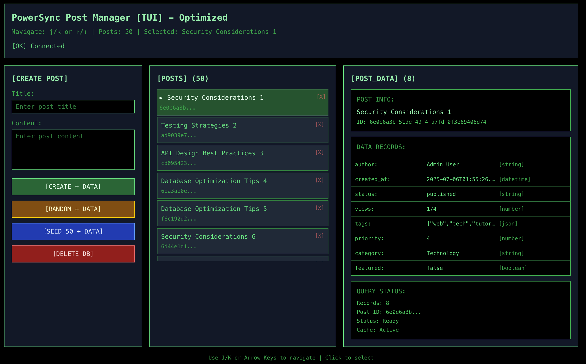

# PowerSync + Kysely + wa-sqlite Demo

A minimal example demonstrating how to use PowerSync with Kysely as a query builder and wa-sqlite for local data persistence in the browser.

> This demo not include the PowerSync server, it's just a demo of how to use PowerSync with Kysely and wa-sqlite in the browser.

## Overview

This project showcases a simple user management interface that stores data locally using:

- **PowerSync** - Local-first sync engine with offline support
- **Kysely** - Type-safe SQL query builder for TypeScript
- **wa-sqlite** - WebAssembly SQLite implementation for browsers
- **React** - UI framework with TanStack Router
- **Tailwind CSS** - Utility-first CSS framework

## Features

- ✅ Local data persistence using SQLite in the browser
- ✅ Type-safe database queries with Kysely
- ✅ Real-time UI updates with PowerSync's reactive queries
- ✅ Offline-first architecture

